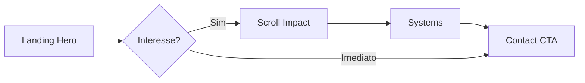
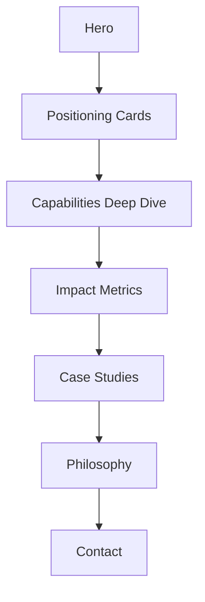

# AI Portfolio — Documentação Completa

> Portfólio premium para Technical Lead em AI Engineering & Full Stack Systems.

---

## 1. Arquitetura de Informação (IA)

### Hierarquia de conteúdo

```
Home (single-page)
├── Hero — Proposição de valor em 10 segundos
├── Positioning — Dual identity (Full Stack + AI Engineer)
├── Capabilities — 4 pilares de expertise
├── Impact — Métricas de produção
├── Systems — Case studies de arquitetura
├── Philosophy — Manifesto de liderança técnica
└── Contact — CTAs de conversão
```

### Princípios de IA

| Princípio | Aplicação |
|-----------|-----------|
| **Scan-first** | Recrutador entende o posicionamento em <10s no Hero |
| **Proof over claims** | Métricas reais substituem skill bars e timelines |
| **Depth on demand** | Cada seção expande um pilar sem sobrecarga textual |
| **Single conversion path** | CTAs convergem para contato (email/LinkedIn) |

### Mapa de navegação

- Header fixo com anchor links: Capabilities → Impact → Systems → Contact
- Skip link para acessibilidade
- Footer com links sociais redundantes

---

## 2. Fluxos de UX

### Fluxo primário — Recrutador (60s)



### Fluxo secundário — Hiring Manager (3min)



### Micro-interações

| Elemento | Comportamento |
|----------|---------------|
| Hero 3D | Rede neural rotativa — fallback estático com reduced motion |
| Cards | Hover glass + border glow |
| Metrics | Count-up animado no viewport |
| Nav | Blur backdrop após scroll |
| Mobile | Menu slide com body lock |

---

## 3. Wireframes (ASCII)

### Desktop — Hero (1440px)

```
┌─────────────────────────────────────────────────────────────┐
│  WQ.          Capabilities  Impact  Systems  Contact  [CTA] │
├─────────────────────────────────────────────────────────────┤
│                                                             │
│     [Badge: Available for leadership roles]                 │
│                                                             │
│     Full Stack Engineer & AI Engineer          ← gradient  │
│                                                             │
│     I architect AI agents, MCP ecosystems...                │
│                                                             │
│     [View selected systems]  [Start a conversation]         │
│                                                             │
│     AI AGENTS · MCP · FULL STACK · TECH LEADERSHIP          │
│                                                             │
│              ○ 3D Neural Network Background ○                 │
│                          ↓                                  │
└─────────────────────────────────────────────────────────────┘
```

### Desktop — Capabilities (2x2 grid)

```
┌──────────────────────────┐  ┌──────────────────────────┐
│ 🧠 AI Agents & LLM       │  │ 🔗 MCP Architecture      │
│ Description...           │  │ Description...           │
│ [metric] [metric]        │  │ [metric] [metric]        │
└──────────────────────────┘  └──────────────────────────┘
┌──────────────────────────┐  ┌──────────────────────────┐
│ 📐 System Architecture   │  │ 🧭 Technical Leadership  │
│ Description...           │  │ Description...           │
│ [metric] [metric]        │  │ [metric] [metric]        │
└──────────────────────────┘  └──────────────────────────┘
```

### Mobile — Stack vertical

```
┌─────────────────┐
│ WQ.        [≡]  │
├─────────────────┤
│ Hero (full)     │
│ Positioning 1   │
│ Positioning 2   │
│ Capability 1    │
│ Capability 2    │
│ ...             │
│ Contact cards   │
└─────────────────┘
```

---

## 4. Design System

### Tokens de cor

| Token | Valor | Uso |
|-------|-------|-----|
| `--background` | `#030303` | Fundo principal (dark-first) |
| `--foreground` | `#fafafa` | Texto primário |
| `--muted` | `#a1a1aa` | Texto secundário |
| `--accent` | `#00d4aa` | CTA, highlights, 3D particles |
| `--accent-secondary` | `#8b5cf6` | Gradiente, conexões 3D |
| `--border` | `rgba(255,255,255,0.08)` | Bordas glass |
| `--card` | `rgba(255,255,255,0.03)` | Superfícies elevadas |

### Tipografia

| Nível | Font | Size | Weight |
|-------|------|------|--------|
| H1 | Geist Sans | 4xl→7xl | 600 |
| H2 | Geist Sans | 3xl→4xl | 600 |
| H3 | Geist Sans | lg→2xl | 600 |
| Body | Geist Sans | base→xl | 400 |
| Label | Geist Mono | xs | 500, uppercase, tracking-widest |
| Code/Metrics | Geist Mono | xs | 400 |

### Espaçamento

- Section padding: `py-24 md:py-32`
- Container: `max-w-6xl px-6`
- Card padding: `p-8 md:p-10`
- Grid gap: `gap-6`

### Componentes base (Shadcn-style)

- `Button` — default (accent glow), outline, ghost, link
- `Badge` — default, accent, outline
- `Separator` — horizontal/vertical
- `Section` — wrapper com label, title, description + scroll reveal

### Efeitos

- `.glass` — backdrop-blur + border sutil
- `.gradient-text` — accent → secondary
- `.grid-bg` — grid com radial mask
- `.glow-accent` — box-shadow para CTAs

---

## 5. Arquitetura de Componentes

```
src/
├── app/
│   ├── layout.tsx          # Metadata, fonts, JSON-LD
│   ├── page.tsx            # Composição das sections
│   ├── globals.css         # Design tokens
│   ├── sitemap.ts
│   └── robots.ts
├── components/
│   ├── ui/                 # Primitivos (Button, Badge, Separator)
│   ├── layout/             # Header, Footer, Section
│   ├── sections/           # Hero, Positioning, Capabilities, etc.
│   ├── three/              # React Three Fiber (HeroScene)
│   └── seo/                # JSON-LD structured data
├── hooks/
│   └── use-reduced-motion.ts
└── lib/
    ├── site-config.ts      # Conteúdo centralizado
    ├── motion.ts           # Variants Framer Motion
    └── utils.ts            # cn() helper
```

### Responsabilidades

| Camada | Responsabilidade |
|--------|------------------|
| `site-config.ts` | Single source of truth para conteúdo |
| `sections/*` | Uma seção = um componente, client-side para motion |
| `three/*` | Isolado, dynamic import (no SSR) |
| `ui/*` | Stateless, reutilizável, CVA variants |

---

## 6. Estratégia Responsiva

### Breakpoints (Tailwind defaults)

| Breakpoint | Comportamento |
|------------|---------------|
| `< md` (768px) | Stack vertical, menu hamburger, typography reduzida |
| `md` | Grid 2 colunas (positioning, capabilities) |
| `lg` | Impact 4 colunas, typography full |

### Adaptações mobile-first

1. Hero H1: `text-4xl` → `md:text-6xl` → `lg:text-7xl`
2. Navigation: links ocultos → hamburger com AnimatePresence
3. Cards: full-width stack → 2-col grid
4. 3D scene: `dpr={[1, 1.5]}` para performance em mobile
5. Touch targets: mínimo 44px (buttons h-11)

---

## 7. Motion System

### Easing

- Primary: `[0.16, 1, 0.3, 1]` (ease-out-expo) — sensação premium Framer

### Variants (`lib/motion.ts`)

| Variant | Uso |
|---------|-----|
| `fadeUp` | Entrada de elementos com stagger |
| `fadeIn` | Opacity simples |
| `staggerContainer` | Parent para filhos sequenciais |
| `scaleIn` | Cards/modals |
| `slideInLeft` | Elementos laterais |

### Regras

1. **Scroll-triggered**: `whileInView` + `viewport: { once: true, margin: "-80px" }`
2. **Hero**: animate on mount (não scroll)
3. **Reduced motion**: hook desabilita 3D e count-up
4. **Performance**: transform/opacity only (GPU-accelerated)

---

## 8. Diretrizes de Acessibilidade

| Critério | Implementação |
|----------|---------------|
| **Skip link** | "Skip to content" → `#main-content` |
| **Landmarks** | `<header>`, `<main>`, `<footer>`, `<nav>`, `<section>` |
| **Headings** | H1 único no Hero, H2 por seção, H3 em cards |
| **Focus** | `.focus-ring` em todos os interativos |
| **ARIA** | `aria-label` em nav, `aria-labelledby` em sections |
| **Reduced motion** | `prefers-reduced-motion` desabilita animações pesadas |
| **Contraste** | Foreground #fafafa sobre #030303 (>15:1) |
| **Touch** | Targets ≥44px |
| **Images/3D** | `aria-hidden="true"` em decorativos |

### WCAG 2.2 target: AA

---

## 9. Estratégia SEO

### On-page

- Title: `{Name} — Technical Lead · AI Engineering & Full Stack Systems`
- Meta description com keywords naturais (AI Agents, MCP, Full Stack)
- Canonical URL via `metadataBase`
- Open Graph + Twitter cards

### Structured Data

- JSON-LD `Person` schema com `knowsAbout`, `sameAs`, `jobTitle`

### Technical SEO

- `sitemap.xml` auto-gerado
- `robots.txt` allow all
- Semantic HTML5
- `lang="en"` (ajustável)
- Font display: swap

### Keywords alvo

1. AI Engineer portfolio
2. Technical Lead AI
3. MCP Architecture
4. Full Stack AI Engineer
5. AI Agents production

---

## 10. Plano de Implementação UI

### Fase 1 — Foundation ✅
- [x] Next.js 15 + React 19 + Tailwind v4
- [x] Design tokens em globals.css
- [x] Shadcn-style UI primitives
- [x] site-config centralizado

### Fase 2 — Layout & Navigation ✅
- [x] Header com scroll blur + mobile menu
- [x] Footer com social links
- [x] Section wrapper com scroll reveal

### Fase 3 — Sections ✅
- [x] Hero com 3D neural network (R3F)
- [x] Positioning dual cards
- [x] Capabilities 2x2 grid
- [x] Impact com count-up metrics
- [x] Systems case studies
- [x] Philosophy blockquote
- [x] Contact cards + CTA

### Fase 4 — Polish
- [ ] OG image dinâmica (`opengraph-image.tsx`)
- [ ] Favicon customizado
- [ ] Analytics (Plausible/Vercel)
- [ ] Lighthouse audit >95

### Fase 5 — Deploy
- [ ] Vercel deploy
- [ ] Domain + SSL
- [ ] Google Search Console

---

## Comandos

```bash
cd ai-portfolio
npm run dev      # http://localhost:3000
npm run build    # Production build
npm run start    # Serve production
```

## Personalização

Edite `src/lib/site-config.ts` para alterar nome, links, métricas e case studies.
